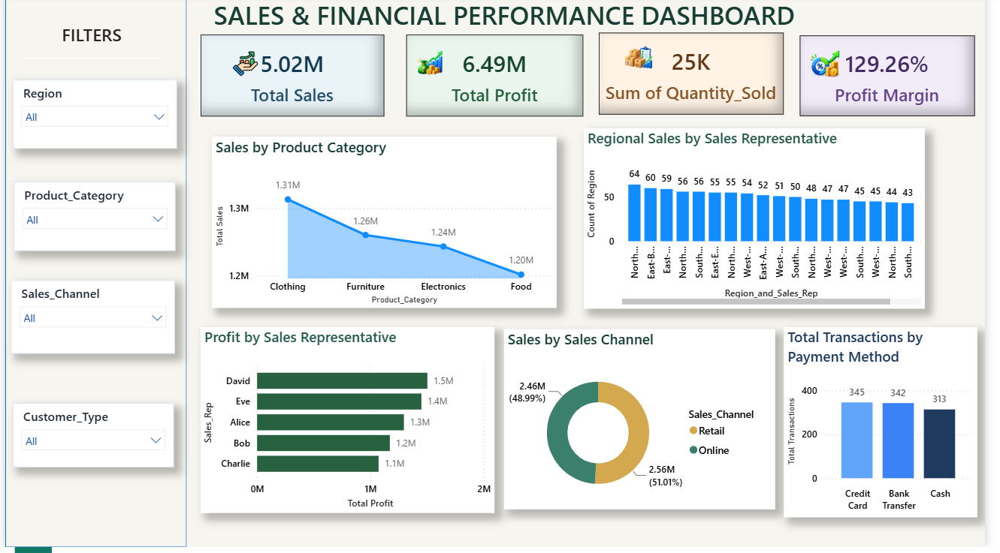

# Sales-Revenue-Analysis-Dashboard
Interactive Power BI dashboard for analyzing sales performance, revenue trends, product performance, and key business KPIs.
## 📌 Project Overview

The **Sales & Financial Performance Dashboard** is an interactive Power BI dashboard designed to analyze sales, profit, quantity sold, profit margin, sales representatives, product categories, sales channels, regions, and payment methods.

The dashboard provides a consolidated view of business performance and allows users to interactively analyze the data using filters.

## 🎯 Objectives

- Analyze overall sales and profit performance
- Monitor key business KPIs
- Compare sales across product categories
- Analyze profit generated by sales representatives
- Understand sales distribution across sales channels
- Analyze transactions by payment method
- Compare regional performance
- Provide interactive filtering for detailed analysis

## 🛠️ Tools & Technologies

- **Power BI**
- **Power Query** – Data cleaning and transformation
- **DAX** – KPI and measure calculations
- **Excel / CSV** – Data source

## 📌 Key Performance Indicators

The dashboard displays the following KPIs:

- **Total Sales:** 5.02M
- **Total Profit:** 6.49M
- **Total Quantity Sold:** 25K
- **Profit Margin:** 129.26%

## 📈 Dashboard Features

### 1. Sales by Product Category

A line chart compares total sales across the following product categories:

- Clothing
- Furniture
- Electronics
- Food

This helps identify the sales contribution of each product category.

### 2. Regional Sales by Sales Representative

A column chart displays the count of regional sales representatives and provides a comparative view across region and sales-representative combinations.

### 3. Profit by Sales Representative

A bar chart compares profit generated by individual sales representatives:

- David
- Eve
- Alice
- Bob
- Charlie

This helps analyze the contribution of each sales representative to overall profit.

### 4. Sales by Sales Channel

A donut chart shows the distribution of sales between:

- Retail
- Online

The dashboard displays both the sales amount and percentage contribution for each channel.

### 5. Total Transactions by Payment Method

A column chart analyzes transactions based on payment method:

- Credit Card
- Bank Transfer
- Cash

This provides an overview of transaction activity by payment type.

## 🎛️ Interactive Filters

The dashboard includes slicers that allow users to filter the analysis by:

- **Region**
- **Product Category**
- **Sales Channel**
- **Customer Type**

These filters make it possible to perform focused and interactive analysis.

## 💡 Key Insights

The dashboard can be used to identify:

- Overall sales and profit performance
- Sales contribution from different product categories
- Profit contribution of individual sales representatives
- Distribution of sales between retail and online channels
- Transaction volume across different payment methods
- Regional sales patterns
- Performance based on customer type

## 📷 Dashboard Preview

